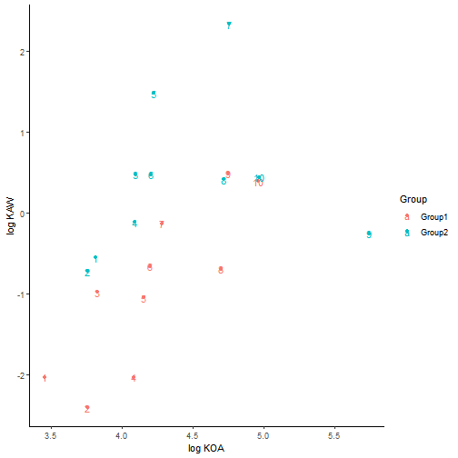
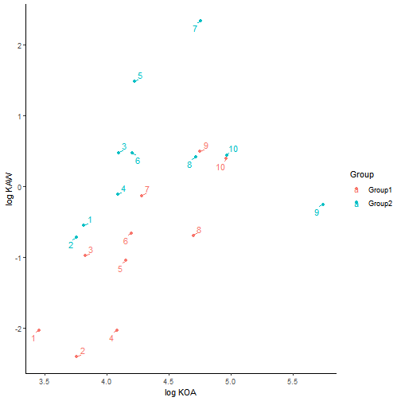
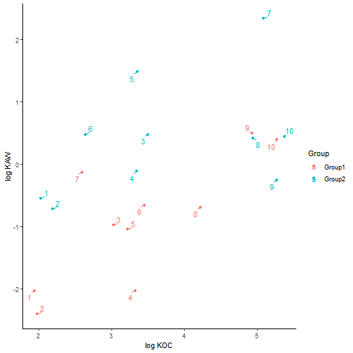

# BEFORE YOU START

Create a new RStudio Project for Tutorial X and copy this .Rmd file into it.

## Packages
=
Install the required packages *webchem* and *tidyverse*. We will use *webchem* to quickly access the online chemical database **PubChem** and convert our compound list into a format recognized by CompTox.


```r
if(!require("webchem")) install.packages("webchem") #Only runs if the package is not already installed on your device.
if(!require("tidyverse")) install.packages("tidyverse")

library(webchem) #Loads package into memory so it can be used by the code.
library(tidyverse)
```

# Part 1


```r
cmpdList1 <- c( #Perfluoroalkyl acids===
  "FC(F)(F)C(F)(F)C(F)(F)C(=O)O", #PFBA
  "FC(F)(F)C(F)(F)C(F)(F)C(F)(F)C(=O)O", #PFPA
  "FC(F)(F)C(F)(F)C(F)(F)C(F)(F)C(F)(F)C(=O)O", #PFHxA
  "FC(F)(F)C(F)(F)C(F)(F)C(F)(F)C(F)(F)C(F)(F)C(=O)O", #PFHpA
  "FC(F)(F)C(F)(F)C(F)(F)C(F)(F)C(F)(F)C(F)(F)C(F)(F)C(=O)O", #PFOA
  "FC(F)(F)C(F)(F)C(F)(F)C(F)(F)C(F)(F)C(F)(F)C(F)(F)C(F)(F)C(=O)O", #PFNA
  "FC(F)(F)C(F)(F)C(F)(F)C(F)(F)C(F)(F)C(F)(F)C(F)(F)C(F)(F)C(F)(F)C(=O)O", #PFDA
  "FC(F)(F)C(F)(F)C(F)(F)C(F)(F)C(F)(F)C(F)(F)C(F)(F)C(F)(F)C(F)(F)C(F)(F)C(=O)O", #PFUA
  "FC(F)(F)C(F)(F)C(F)(F)C(F)(F)C(F)(F)C(F)(F)C(F)(F)C(F)(F)C(F)(F)C(F)(F)C(F)(F)C(=O)O", #PFDoDA
  "FC(F)(F)C(F)(F)C(F)(F)C(F)(F)C(F)(F)C(F)(F)C(F)(F)C(F)(F)C(F)(F)C(F)(F)C(F)(F)C(F)(F)C(=O)O" #PFTrDA
)
# Every SMILES string must be enclosed in quotation marks.==++
# Also make sure that every line inside the brackets ends in a comma EXCEPT the last one.


cmpdList2 <- c( #Fluorotelomer alcohols
  "FC(F)(F)C(F)(F)C(F)(F)C(F)(F)CCO", #4:2 FTOH
  "FC(F)(F)C(F)(F)C(F)(F)C(F)(F)C(F)(F)CO", #5:1 FTOH
  "FC(F)(F)C(F)(F)C(F)(F)C(F)(F)C(F)(F)C(F)(F)CCO", #6:2 FTOH
  "FC(F)(F)C(F)(F)C(F)(F)C(F)(F)C(F)(F)C(F)(F)C(F)(F)CO", #7:1 FTOH
  "FC(F)(F)C(F)(F)C(F)(F)C(F)(F)C(F)(F)C(F)(F)C(F)(F)C(F)(F)CCO", #8:2 FTOH
  "FC(F)(F)C(F)(F)C(F)(F)C(F)(F)C(F)(F)C(F)(F)C(F)(F)C(F)(F)C(F)(F)CO", #9:1 FTOH
  "FC(F)(F)C(F)(F)C(F)(F)C(F)(F)C(F)(F)C(F)(F)C(F)(F)C(F)(F)C(F)(F)C(F)(F)CCO", #10:2 FTOH
  "FC(F)(F)C(F)(F)C(F)(F)C(F)(F)C(F)(F)C(F)(F)C(F)(F)C(F)(F)C(F)(F)C(F)(F)C(F)(F)CO", #11:1 FTOH
  "FC(F)(F)C(F)(F)C(F)(F)C(F)(F)C(F)(F)C(F)(F)C(F)(F)C(F)(F)C(F)(F)C(F)(F)C(F)(F)C(F)(F)CCO", #12:2 FTOH
  "FC(F)(F)C(F)(F)C(F)(F)C(F)(F)C(F)(F)C(F)(F)C(F)(F)C(F)(F)C(F)(F)C(F)(F)C(F)(F)C(F)(F)C(F)(F)CO" #13:1 FTOH
)

cmpdList3 <- c( #Chlorinated Paraffins
  "ClCC(Cl)C(Cl)C(Cl)C(Cl)C(Cl)C(Cl)C(Cl)C(Cl)CCl",
  "ClCC(Cl)C(Cl)C(Cl)C(Cl)C(Cl)C(Cl)C(Cl)C(Cl)C(Cl)CCl",
  "ClCC(Cl)C(Cl)C(Cl)C(Cl)C(Cl)C(Cl)C(Cl)C(Cl)C(Cl)C(Cl)CCl",
  "ClCC(Cl)C(Cl)C(Cl)C(Cl)C(Cl)C(Cl)C(Cl)C(Cl)C(Cl)C(Cl)C(Cl)CCl",
  "ClCC(Cl)C(Cl)C(Cl)C(Cl)C(Cl)C(Cl)C(Cl)C(Cl)C(Cl)C(Cl)C(Cl)C(Cl)CCl",
  "ClCC(Cl)C(Cl)C(Cl)C(Cl)C(Cl)C(Cl)C(Cl)C(Cl)C(Cl)C(Cl)C(Cl)C(Cl)C(Cl)CCl",
  "ClCC(Cl)C(Cl)C(Cl)C(Cl)C(Cl)C(Cl)C(Cl)C(Cl)C(Cl)C(Cl)C(Cl)C(Cl)C(Cl)C(Cl)CCl",
  "ClCC(Cl)C(Cl)C(Cl)C(Cl)C(Cl)C(Cl)C(Cl)C(Cl)C(Cl)C(Cl)C(Cl)C(Cl)C(Cl)C(Cl)C(Cl)CCl",
  "ClCC(Cl)C(Cl)C(Cl)C(Cl)C(Cl)C(Cl)C(Cl)C(Cl)C(Cl)C(Cl)C(Cl)C(Cl)C(Cl)C(Cl)C(Cl)C(Cl)CCl",
  "ClCC(Cl)C(Cl)C(Cl)C(Cl)C(Cl)C(Cl)C(Cl)C(Cl)C(Cl)C(Cl)C(Cl)C(Cl)C(Cl)C(Cl)C(Cl)C(Cl)C(Cl)CCl",
  "ClCC(Cl)C(Cl)C(Cl)C(Cl)C(Cl)C(Cl)C(Cl)C(Cl)C(Cl)C(Cl)C(Cl)C(Cl)C(Cl)C(Cl)C(Cl)C(Cl)C(Cl)C(Cl)CCl"
)

cmpdList4 <- c( #Polychlorinated biphenyls
  "ClC1=CC=CC(C2=CC=CC=C2)=C1",
  "ClC1=C(Cl)C=CC(C2=CC=CC=C2)=C1",
  "ClC1=C(Cl)C(Cl)=CC(C2=CC=CC=C2)=C1",
  "ClC1=C(Cl)C(Cl)=C(Cl)C(C2=CC=CC=C2)=C1",
  "ClC1=C(Cl)C(Cl)=C(Cl)C(C2=C(Cl)C=CC=C2)=C1",
  "ClC1=C(Cl)C(Cl)=C(Cl)C(C2=C(Cl)C(Cl)=CC=C2)=C1",
  "ClC1=C(Cl)C(Cl)=C(Cl)C(C2=C(Cl)C(Cl)=C(Cl)C=C2)=C1",
  "ClC1=C(Cl)C(Cl)=C(Cl)C(C2=C(Cl)C(Cl)=C(Cl)C(Cl)=C2)=C1",
  "ClC1=C(Cl)C(Cl)=C(Cl)C(C2=C(Cl)C(Cl)=C(Cl)C(Cl)=C2(Cl))=C1",
  "ClC1=C(Cl)C(Cl)=C(Cl)C(C2=C(Cl)C(Cl)=C(Cl)C(Cl)=C2(Cl))=C1(Cl)"
)

cmpdList5 <- c( #Alkyl OPFRs
  "CCOP(=O)(OCC)OCC", #TEP
  "CCCOP(=O)(OCCC)OCCC", #TPP
  "CCCCOP(=O)(OCCCC)OCCCC", #TBP
  "CCCCCOP(=O)(OCCCCC)OCCCCC", #TPeP
  "CCCCCCOP(=O)(OCCCCCC)OCCCCCC", #THxP
  "CCCCCCCOP(=O)(OCCCCCCC)OCCCCCCC", #THpP
  "CCCCCCCCOP(=O)(OCCCCCCCC)OCCCCCCCC", #TOP
  "CCCCCCCCCOP(=O)(OCCCCCCCCC)OCCCCCCCCC", #TNP
  "CCCCCCCCCCOP(=O)(OCCCCCCCCCC)OCCCCCCCCCC" #TDP
)
```


The code below will convert the SMILES strings into a search format recognized by the CompTox database. After running this block you should have two text files in your project folder.


```r
chemical <- tibble(SMILES = cmpdList1) #Converts the input data into a 1-column tibble (tidy table)

PubChem_IDs <- get_cid(chemical$SMILES, from = "smiles") #Obtains the PubChem database IDs for each input compound

InChiKeys <- pc_prop(PubChem_IDs$cid, properties = c("InChIKey", "MolecularFormula")) %>% #Obtains the International Chemical Identifier Key (InChIKey) for each PubChem ID
  mutate(CID = as.character(CID))

write_lines(InChiKeys$InChIKey, file = "copy_into_CompTox1.txt") #Outputs to a tab-delimited text file. Feel free to rename this file.


chemical2 <- tibble(SMILES = cmpdList2) 

PubChem_IDs2 <- get_cid(chemical2$SMILES, from = "smiles") 

InChiKeys2 <- pc_prop(PubChem_IDs2$cid, properties = c("InChIKey", "MolecularFormula")) %>% 
  mutate(CID = as.character(CID))

write_lines(InChiKeys2$InChIKey, file = "copy_into_CompTox2.txt") #Rename this text file if desired.
```


# Part 2: CompTox

Step 1: Open the CompTox Dashboard in your internet browser: https://comptox.epa.gov/dashboard/batch-search

Step 2: Under Input Types, select **InChIKey**.

Step 3: Open one of the text files containing your converted compound list and copy the entire contents into the Search window. Make sure there are no empty lines.

Step 4: Below the Search window, click **Choose Export Options**.

Step 5: Scroll down, and use the dropdown to select **CSV** as your output format.

Step 6: Select **OPERA Model Predictions** (found in the Intrinsic and Predicted Properties category). Don't click any other options, except those already highlighted.

Step 7: At the bottom of the page, click **Download Export File**. A popup will appear. Wait a few seconds for it to finish processing, then click **Download File**.

Step 8: Copy the downloaded CSV file into your project folder. Either rename your file to "comptoxresults1.csv"/"comptoxresults2.csv", or change the first parameter of *read_csv* (below) to match the name of your file.

Step 9: Repeat Steps 3-8 for the other list of chemical.


When you've completed the above steps, you can go ahead and run the next code block to process the results into something more manageable.


```r
compTox <- read_csv("comptoxresults1a.csv", col_names = TRUE) %>%
  select(matches("INPUT|NAME|AOH|BIO|HENRY|KM|KOC|LOG")) %>% #Uses text matching to keep only the columns we care about
  rename_with(~ c("Key","Name", "AOH", "BCF", "BIODEG_HL", "HenryLaw_Const", "KM", "log_KOA", "KOC", "log_KOW")) %>% #Renames the columns to be a little more readable
  rowwise() %>%
  mutate(log_KAW = (log_KOW - log_KOA), log_KOC = log10(KOC)) %>%
  select(-c(HenryLaw_Const, KOC, AOH, BCF, BIODEG_HL, KM)) %>% #Deletes unwanted columns
  ungroup() %>%
  mutate(Group = "Group1", CmpdID = row_number()) %>% 
  relocate(matches("Group|CmpdID"), .before = Name)

results <- chemical %>%
  full_join(PubChem_IDs, by = c("SMILES" = "query")) %>% #Combines previously created tables by similar columns
  full_join(InChiKeys, by = c("cid" = "CID")) %>%
  full_join(compTox, by = c("InChIKey" = "Key"))


compTox2 <- read_csv("comptoxresults2a.csv", col_names = TRUE) %>%
  select(matches("INPUT|NAME|AOH|BIO|HENRY|KM|KOC|LOG")) %>% #Uses text matching to keep only the columns we care about
  rename_with(~ c("Key","Name", "AOH", "BCF", "BIODEG_HL", "HenryLaw_Const", "KM", "log_KOA", "KOC", "log_KOW")) %>% #Renames the columns to be a little more readable
  rowwise() %>%
  mutate(log_KAW = (log_KOW - log_KOA), log_KOC = log10(KOC)) %>%
  select(-c(HenryLaw_Const, KOC, AOH, BCF, BIODEG_HL, KM)) %>% #Deletes unwanted columns
  ungroup() %>%
  mutate(Group = "Group2", CmpdID = row_number()) %>%
  relocate(matches("Group|CmpdID"), .before = Name)

results2 <- chemical2 %>%
  full_join(PubChem_IDs2, by = c("SMILES" = "query")) %>% #Combines previously created tables by similar columns
  full_join(InChiKeys2, by = c("cid" = "CID")) %>%
  full_join(compTox2, by = c("InChIKey" = "Key"))


resultsCombined <- results %>%
  bind_rows(results2)

print(resultsCombined)
```

```
## # A tibble: 20 × 11
##    SMILES                            cid   Molec…¹ InChI…² Group CmpdID Name  log_KOA log_KOW log_KAW log_KOC
##    <chr>                             <chr> <chr>   <chr>   <chr>  <int> <chr>   <dbl>   <dbl>   <dbl>   <dbl>
##  1 FC(F)(F)C(F)(F)C(F)(F)C(=O)O      9777  C4HF7O2 YPJUND… Grou…      1 Perf…    3.46    1.43  -2.03     1.95
##  2 FC(F)(F)C(F)(F)C(F)(F)C(F)(F)C(=… 75921 C5HF9O2 CXZGQI… Grou…      2 Perf…    3.76    1.35  -2.41     1.98
##  3 FC(F)(F)C(F)(F)C(F)(F)C(F)(F)C(F… 67542 C6HF11… PXUULQ… Grou…      3 Perf…    3.83    2.85  -0.977    3.03
##  4 FC(F)(F)C(F)(F)C(F)(F)C(F)(F)C(F… 67818 C7HF13… ZWBAMY… Grou…      4 Perf…    4.09    2.06  -2.03     3.32
##  5 FC(F)(F)C(F)(F)C(F)(F)C(F)(F)C(F… 9554  C8HF15… SNGREZ… Grou…      5 Perf…    4.16    3.11  -1.05     3.22
##  6 FC(F)(F)C(F)(F)C(F)(F)C(F)(F)C(F… 67821 C9HF17… UZUFPB… Grou…      6 Perf…    4.20    3.54  -0.662    3.45
##  7 FC(F)(F)C(F)(F)C(F)(F)C(F)(F)C(F… 9555  C10HF1… PCIUEQ… Grou…      7 Perf…    4.28    4.15  -0.131    2.60
##  8 FC(F)(F)C(F)(F)C(F)(F)C(F)(F)C(F… 77222 C11HF2… SIDINR… Grou…      8 Perf…    4.70    4.00  -0.694    4.22
##  9 FC(F)(F)C(F)(F)C(F)(F)C(F)(F)C(F… 67545 C12HF2… CXGONM… Grou…      9 Perf…    4.75    5.24   0.490    4.93
## 10 FC(F)(F)C(F)(F)C(F)(F)C(F)(F)C(F… 3018… C13HF2… LVDGGZ… Grou…     10 Perf…    4.96    5.35   0.389    5.27
## 11 FC(F)(F)C(F)(F)C(F)(F)C(F)(F)CCO  74883 C6H5F9O JCMNMO… Grou…      1 4:2 …    3.82    3.27  -0.550    2.03
## 12 FC(F)(F)C(F)(F)C(F)(F)C(F)(F)C(F… 2782… C6H3F1… QZFZPV… Grou…      2 5:1 …    3.76    3.03  -0.722    2.19
## 13 FC(F)(F)C(F)(F)C(F)(F)C(F)(F)C(F… 69537 C8H5F1… GRJRKP… Grou…      3 3,3,…    4.10    4.57   0.477    3.50
## 14 FC(F)(F)C(F)(F)C(F)(F)C(F)(F)C(F… 67543 C8H3F1… PJDOLC… Grou…      4 7:1 …    4.09    3.97  -0.116    3.35
## 15 FC(F)(F)C(F)(F)C(F)(F)C(F)(F)C(F… 69619 C10H5F… JJUBFB… Grou…      5 3,3,…    4.22    5.70   1.48     3.35
## 16 FC(F)(F)C(F)(F)C(F)(F)C(F)(F)C(F… 2733… C10H3F… NIRPXS… Grou…      6 9:1 …    4.20    4.68   0.474    2.65
## 17 FC(F)(F)C(F)(F)C(F)(F)C(F)(F)C(F… 70083 C12H5F… FLXYIZ… Grou…      7 10:2…    4.76    7.09   2.34     5.09
## 18 FC(F)(F)C(F)(F)C(F)(F)C(F)(F)C(F… 2760… C12H3F… SHTZQF… Grou…      8 11:1…    4.72    5.13   0.415    4.94
## 19 FC(F)(F)C(F)(F)C(F)(F)C(F)(F)C(F… 1623… C14H5F… QBBJBW… Grou…      9 2-(P…    5.74    5.49  -0.254    5.27
## 20 FC(F)(F)C(F)(F)C(F)(F)C(F)(F)C(F… 2776… C14H3F… WYCXYE… Grou…     10 1H,1…    4.97    5.41   0.439    5.37
## # … with abbreviated variable names ¹​MolecularFormula, ²​InChIKey
```

```r
#Optional code for creating a csv (if you want to make your graphs in Excel):

#write_csv(resultsCombined, file = "Predicted_Partioning_Coefficients.csv")
```
# Part 3: Example Plots

Example plot of log KOA as a function of log KAW.


```r
Kplot <- ggplot(data = resultsCombined, mapping = aes(x = log_KOA, y = log_KAW, color = Group, label = CmpdID))+ 
  geom_point()+ #Converts plot to a scatter plot
  geom_text()+ #Adds a text layer for labels
  labs(x = "log KOA", y = "log KAW")+ #Custom axis labels
  theme_classic() #Simplifies layout and removes gridlines
print(Kplot)
```




This is the same plot as above, but with the addition of the optional package *ggrepel*. This prevents data labels from appearing directly on top of data points.


```r
if(!require("ggrepel")) install.packages("ggrepel")
library(ggrepel)

Kplot <- ggplot(data = resultsCombined, mapping = aes(x = log_KOA, y = log_KAW, color = Group, label = CmpdID))+
  geom_point()+
  geom_text_repel(min.segment.length = 0.1)+ #Replaces 'geom_text()' in the previous code block
  labs(x = "log KOA", y = "log KAW")+
  theme_classic()
print(Kplot)
```



Another example plot, this time plotting log KAW as a function of log KOC (organic carbon:water coefficient).


```r
Koc_plot <- ggplot(data = resultsCombined, mapping = aes(x = log_KOC, y = log_KAW, color = Group, label = CmpdID))+
  geom_point()+
  geom_text_repel(min.segment.length = 0.1)+
  labs(x = "log KOC", y = "log KAW")+
  theme_classic()
print(Koc_plot)
```


