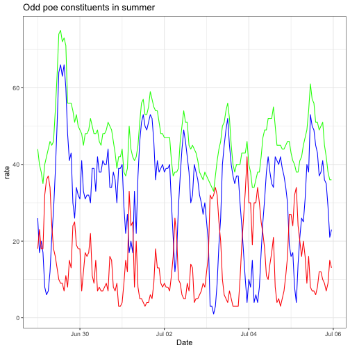

```r
install.packages("tidyverse")
install.packages("zoo")
install.packages("ggpmisc")
install.packages("openxlsx")
```

#Load toy data

```r
winter <- read.csv("toy1_dataset.csv", sep = ",")
winter$date <- convertToDateTime(winter$Date, origin = "1900-01-01")
winter <- subset(winter,unemploy!=-999)
```


```r
winter$poe <- winter$unemploy+winter$psavert
```

#Calculate the mean, standard deviation, and relative standard deviation 

```r
rsdfun <- function(array){
  xbar <- mean(array)
  sigma <- sd(array)
  rsd <- 100*sigma/xbar
  vector <- cbind.data.frame(xbar,sigma,rsd)
  return(vector)
}

unemploy <- rsdfun(winter$unemploy)
psavert <- rsdfun(winter$psavert)
poe <- rsdfun(winter$poe)
Elements <- c("unemploy", "psavert", "poe")
df <- rbind(unemploy, psavert, poe)
df <- cbind(Elements,df)
```

#Format summer data

```r
summer <- read.csv("toy2_dataset.csv", sep = ",")
summer$date <- convertToDateTime(summer$Date, origin = "1900-01-01")
summer <- subset(summer,unemploy!=-999)
```

#POE data

```r
summer <- mutate(summer, poe = unemploy + psavert)
```

#Plot a time series of your summer poe, unemploy of the region and psavert rate over the seven day period covered by your data file.

```r
a_plot <- ggplot(data = summer, aes(x = date))+
  geom_line(aes(y = unemploy), color = "blue")+
  geom_line(aes(y = psavert), color = "red")+
  geom_line(aes(y = poe), color = "green")+
  ggtitle("Odd poe constituents in summer")+
  xlab("Date")+
  ylab("rate")+
  theme_bw()
print(a_plot)
```




#Calculate the mean, standard deviation, and relative standard deviation 

```r
unemploy <- rsdfun(summer$unemploy)
psavert <- rsdfun(summer$psavert)
poe <- rsdfun(summer$poe)
Elements <- c("unemploy", "psavert", "poe")
```

#Plot a correlation plot for psavert rate and unemployment for your summer data set. 


```r
correlation <- ggplot(data = summer, aes(x = unemploy, y = psavert)) + geom_point()+theme_bw()+
  geom_smooth(method = "lm", formula = y ~ x, se = FALSE)+
  stat_poly_eq(aes(label =  paste(stat(eq.label), stat(rr.label), sep = "*\", \"*")),
               formula = y ~ x, rr.digits = 4 , parse = TRUE, label.y = 0.05, size = 3)
```

#Rollmean of summer unemployment

```r
rollmeanS <- rollmean(summer$unemploy, k = 7)
```
